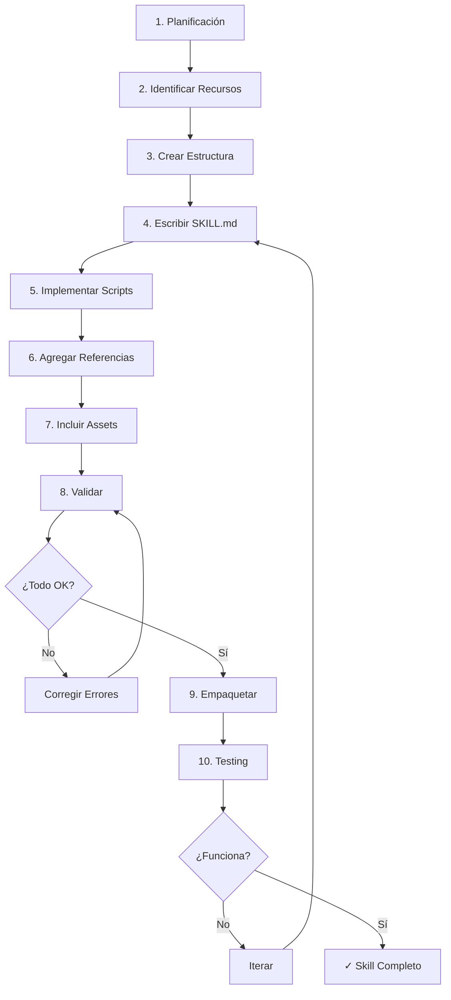

# 📚 Tutorial: Creación de Skills para MCPs

Un tutorial completo y práctico para crear skills profesionales que extienden las capacidades de agentes de IA.

## 🎯 ¿Qué aprenderás?

Este tutorial te enseña paso a paso cómo crear **skills** (paquetes modulares) que transforman agentes de IA genéricos en especialistas de dominio. Usamos como ejemplo la creación de un generador de imágenes con DALL-E, pero los conceptos aplican a cualquier tipo de skill.

### Contenido del Tutorial

- ✅ **Estructura de un Skill** - Anatomía completa de directorios y archivos
- ✅ **SKILL.md** - Sintaxis YAML, frontmatter, y cuerpo Markdown
- ✅ **Scripts ejecutables** - Código Python funcional y testeado
- ✅ **Referencias y Assets** - Organización de recursos bundleados
- ✅ **Mejores Prácticas** - 8 principios de diseño profesional
- ✅ **Antipatrones** - 8 errores comunes a evitar
- ✅ **Validación y Empaquetado** - Proceso completo de distribución

## 🚀 Inicio Rápido

### Descarga el Tutorial

```bash
# Clona el repositorio
git clone https://github.com/tu-usuario/tutorial-skills-mcp.git
cd tutorial-skills-mcp

# Lee el tutorial
cat tutorial-crear-skill-imagegen.md
```

### O léelo online

📖 [**Ver Tutorial Completo**](./tutorial-crear-skill-imagegen.md)

## 📖 Estructura del Repositorio

```
tutorial-skills-mcp/
├── README.md                              # Este archivo
├── tutorial-crear-skill-imagegen.md       # Tutorial principal
└── examples/                              # (Próximamente)
    └── image-generator/                   # Skill completo de ejemplo
        ├── SKILL.md
        ├── scripts/
        ├── references/
        └── assets/
```

## 💡 ¿Para quién es este tutorial?

- **Desarrolladores** que quieren extender las capacidades de Claude u otros agentes
- **Equipos** que necesitan skills personalizados para workflows internos
- **Creadores** que desean compartir skills con la comunidad
- **Cualquiera** interesado en entender cómo funcionan los sistemas de skills para IA

### Requisitos Previos

- Conocimiento básico de Markdown
- Familiaridad con YAML (opcional pero útil)
- Experiencia con Python (solo para la sección de scripts)
- Comprensión de conceptos de APIs (para el ejemplo)

**No necesitas experiencia previa creando skills** - este tutorial asume que empiezas desde cero.

## 🎓 Qué es un Skill

Un **skill** es un paquete modular y auto-contenido que extiende las capacidades de un agente de IA mediante:

1. **Conocimiento especializado** - Información de dominio específico
2. **Workflows** - Procedimientos paso a paso
3. **Integraciones** - Scripts, APIs, y herramientas
4. **Recursos bundleados** - Templates, referencias, y assets

Piensa en un skill como una "guía de incorporación" que transforma un agente genérico en un especialista.

### Ejemplo de Skills Comunes

| Tipo de Skill | Propósito | Componentes Clave |
|---------------|-----------|-------------------|
| **Generador de Imágenes** | Crear imágenes con DALL-E | Script de API, prompts de ejemplo |
| **Editor de PDFs** | Manipular documentos PDF | Scripts de procesamiento, docs API |
| **Analizador de Datos** | Procesar y visualizar datos | Scripts Python, templates de reports |
| **Brand Guidelines** | Mantener consistencia de marca | Assets visuales, guías de estilo |

## 📋 Estructura de un Skill

Todo skill sigue esta estructura:

```
mi-skill/
├── SKILL.md              # (OBLIGATORIO) Instrucciones principales
├── scripts/              # (OPCIONAL) Código ejecutable
│   └── helper.py
├── references/           # (OPCIONAL) Documentación detallada
│   └── api_docs.md
└── assets/              # (OPCIONAL) Archivos para output
    └── template.png
```

### Componentes

#### SKILL.md (Obligatorio)
- **Frontmatter YAML**: Metadata con `name` y `description`
- **Cuerpo Markdown**: Instrucciones de uso y workflow

#### scripts/ (Opcional)
- Código Python, Bash, etc.
- Para tareas que requieren ejecución determinista
- Se pueden ejecutar sin cargar en contexto

#### references/ (Opcional)
- Documentación detallada
- Se carga solo cuando el agente lo necesita
- Mantiene SKILL.md ligero y eficiente

#### assets/ (Opcional)
- Templates, imágenes, fonts, etc.
- NO se cargan en contexto
- Se usan directamente en el output

## 🎯 Ejemplo Práctico: Image Generator

El tutorial usa como ejemplo un **generador de imágenes con DALL-E** que incluye:

### Características del Ejemplo

✨ **Completo y funcional**
- Script Python testeado para llamadas a API
- Manejo robusto de errores
- Validación de parámetros
- Gestión segura de API keys

📚 **Documentación exhaustiva**
- Referencia completa de API de DALL-E
- Guía de prompt engineering
- Ejemplos de prompts efectivos

🎨 **Assets útiles**
- Colección de prompts de ejemplo
- Casos de uso por categoría
- Templates de transformación

### Aplicaciones Reales

Este skill permite a un agente:

```
Usuario: "Genera un logo minimalista para mi cafetería"

Agente: [Usa el skill]
        [Optimiza el prompt con mejores prácticas]
        [Llama al script con parámetros correctos]
        [Descarga y guarda la imagen]
        [Entrega resultado al usuario]
```

## 🛠️ Herramientas y Scripts

El tutorial incluye referencias a herramientas del ecosistema de Skills:

### Scripts de Utilidad

```bash
# Inicializar un nuevo skill
init_skill.py mi-nuevo-skill --path ./skills

# Validar estructura del skill
quick_validate.py ./mi-nuevo-skill

# Empaquetar para distribución
package_skill.py ./mi-nuevo-skill
```

Estos scripts automatizan tareas comunes y validan que tu skill cumple con estándares.

## 📚 Secciones del Tutorial

### 1. Fundamentos
- ¿Qué es un skill?
- Estructura y componentes
- Cuándo crear un skill

### 2. Planificación
- Identificar casos de uso
- Definir recursos necesarios
- Convenciones de nombres

### 3. Implementación
- Escribir SKILL.md
- Frontmatter YAML correcto
- Crear scripts funcionales
- Organizar referencias

### 4. Mejores Prácticas
- Progressive Disclosure
- Token efficiency
- Degrees of freedom
- Ejemplos vs explicaciones

### 5. Antipatrones
- Errores comunes
- Qué evitar
- Cómo corregir problemas

### 6. Validación y Testing
- Checklist de validación
- Proceso de empaquetado
- Testing con casos reales

## 🎓 Mejores Prácticas Destacadas

### 1. Progressive Disclosure
Carga información en niveles:
- **Nivel 1**: Metadata (siempre en contexto)
- **Nivel 2**: SKILL.md body (cuando se activa)
- **Nivel 3**: References (cuando se necesitan)

### 2. Token Efficiency
Cada palabra cuenta. Sé conciso:

❌ **Verboso** (50 tokens):
> "In order to generate an image, you should first validate that the API key is present..."

✅ **Conciso** (15 tokens):
> "1. Validate API key 2. Construct prompt 3. Call API"

### 3. Concrete Examples
Prefiere ejemplos sobre explicaciones:

❌ **Abstracto**:
> "Include details about style and composition"

✅ **Concreto**:
> "Transform 'a dog' → 'A golden retriever in a sunny meadow, photorealistic'"

### 4. Write for AI
Tu audiencia es un agente de IA:
- Usa forma imperativa
- Sé específico y directo
- Evita ambigüedades
- Proporciona ejemplos

## ⚠️ Antipatrones a Evitar

### ❌ 1. Documentación Extra Innecesaria
**NO crear**: README.md, INSTALLATION.md, CHANGELOG.md dentro del skill

### ❌ 2. Triggers en el Body
**INCORRECTO**: Poner "When to use" en el cuerpo de SKILL.md
**CORRECTO**: Incluir todos los triggers en la `description` del frontmatter

### ❌ 3. Duplicación de Contenido
No repitas información entre SKILL.md y references/

### ❌ 4. Scripts Sin Testear
Siempre testea cada script antes de incluirlo

### ❌ 5. Hardcoded Secrets
Nunca incluyas API keys o secrets directamente en el código

## 🔄 Workflow de Creación



## 📦 Distribución de Skills

Una vez completado, un skill se empaqueta en un archivo `.skill`:

```bash
# Empaquetar
package_skill.py ./image-generator

# Resultado
image-generator.skill  # ZIP con extensión .skill
```

El archivo `.skill` puede compartirse y instalarse en cualquier sistema compatible.

## 🤝 Contribuir

¿Encontraste un error? ¿Tienes una sugerencia? ¡Las contribuciones son bienvenidas!

### Cómo Contribuir

1. **Fork** este repositorio
2. Crea una **branch** para tu feature (`git checkout -b feature/mejora-tutorial`)
3. **Commit** tus cambios (`git commit -m 'Agrega sección sobre X'`)
4. **Push** a la branch (`git push origin feature/mejora-tutorial`)
5. Abre un **Pull Request**

### Ideas de Contribución

- 📝 Mejorar explicaciones existentes
- 🎯 Agregar más ejemplos de skills
- 🐛 Reportar errores o inconsistencias
- 🌍 Traducciones a otros idiomas
- 💡 Sugerir mejores prácticas adicionales

## 📄 Licencia

Este tutorial está bajo licencia [MIT](LICENSE).

Eres libre de:
- ✅ Usar el tutorial para aprender
- ✅ Modificar y adaptar el contenido
- ✅ Distribuir y compartir
- ✅ Usar en proyectos comerciales

## 🙏 Reconocimientos

Este tutorial se basa en:
- Documentación oficial del sistema de Skills
- Mejores prácticas de la comunidad
- Ejemplos de skills existentes (docx, pdf, pptx, xlsx)
- Feedback de desarrolladores

## 📞 Contacto y Soporte

- **Issues**: [GitHub Issues](https://github.com/tu-usuario/tutorial-skills-mcp/issues)
- **Discusiones**: [GitHub Discussions](https://github.com/tu-usuario/tutorial-skills-mcp/discussions)
- **Email**: tu-email@ejemplo.com

## 🗺️ Roadmap

### Versión Actual (v1.0)
- ✅ Tutorial completo de creación de skills
- ✅ Ejemplo funcional: Image Generator
- ✅ Mejores prácticas y antipatrones
- ✅ Guías de validación y empaquetado

### Próximas Versiones

**v1.1** (Planificado)
- [ ] Ejemplo adicional: PDF Editor skill
- [ ] Video tutorial complementario
- [ ] Templates de skills comunes

**v1.2** (Futuro)
- [ ] Skill marketplace y galería
- [ ] Testing framework para skills
- [ ] CI/CD para validación automática

**v2.0** (Visión)
- [ ] Skills avanzados con MCP servers
- [ ] Composición de skills
- [ ] Skills multimodales

## 📊 Estadísticas del Proyecto

- **Líneas de tutorial**: ~1,100
- **Ejemplos de código**: 15+
- **Secciones principales**: 10
- **Mejores prácticas**: 8
- **Antipatrones documentados**: 8

## 🌟 Agradecimientos Especiales

Un agradecimiento especial a todos los que contribuyeron con feedback y sugerencias para hacer este tutorial más útil y completo.

---

<div align="center">

**¿Te resultó útil este tutorial?** ⭐ ¡Dale una estrella al repositorio!

**¿Creaste un skill siguiendo este tutorial?** 🎉 ¡Compártelo en las discusiones!

[📖 Leer Tutorial](./tutorial-crear-skill-imagegen.md) | [💬 Discusiones](https://github.com/tu-usuario/tutorial-skills-mcp/discussions) | [🐛 Reportar Issue](https://github.com/tu-usuario/tutorial-skills-mcp/issues)

</div>

---

<div align="center">
  <sub>Construido con ❤️ para la comunidad de desarrolladores de IA</sub>
</div>